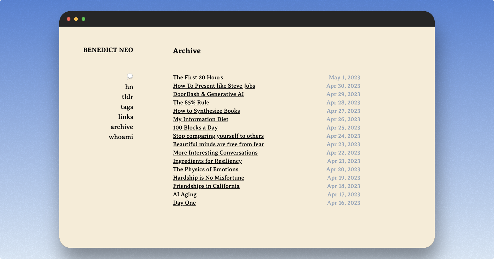

# Blog



A minimalistic blog made with Next.js and Tailwind CSS.

Design inspired by [James Quiambao](https://www.jquiambao.com/) and [Lee Robinson](https://github.com/leerob/leerob.io)

Tutorial on how to build this blog can be found [here](https://www.youtube.com/watch?v=Hiabp1GY8fA).

OpenAI code taken from [magic-text](https://github.com/jxnl/magic-text)

## TODO

- [ ] [switch to mdx](https://github.com/leerob/leerob.io/tree/main/app) which supports images
- [ ] Switch to [contentlayer](https://github.com/leerob/leerob.io/blob/532e402af3bd1777ee1575a249a91f5d27f0c723/app/sitemap.ts#L4)
- [ ] https://www.contentlayer.dev/docs/environments/nextjs
- [ ] sitemap https://github.com/leerob/leerob.io/blob/532e402af3bd1777ee1575a249a91f5d27f0c723/app/sitemap.ts#L4
- [ ] https://leerob.io/blog/nextjs-sitemap-robots

## Setting up Planetscale for /thoughts page

```bash
brew install planetscale/tap/pscale
brew install mysql-client
```

```bash
pscale shell <DB_NAME> main
```

Run this to create table

```sql
CREATE TABLE tweets (
  id INT AUTO_INCREMENT PRIMARY KEY,
  content TEXT NOT NULL,
  created_at TIMESTAMP DEFAULT CURRENT_TIMESTAMP
);
```
